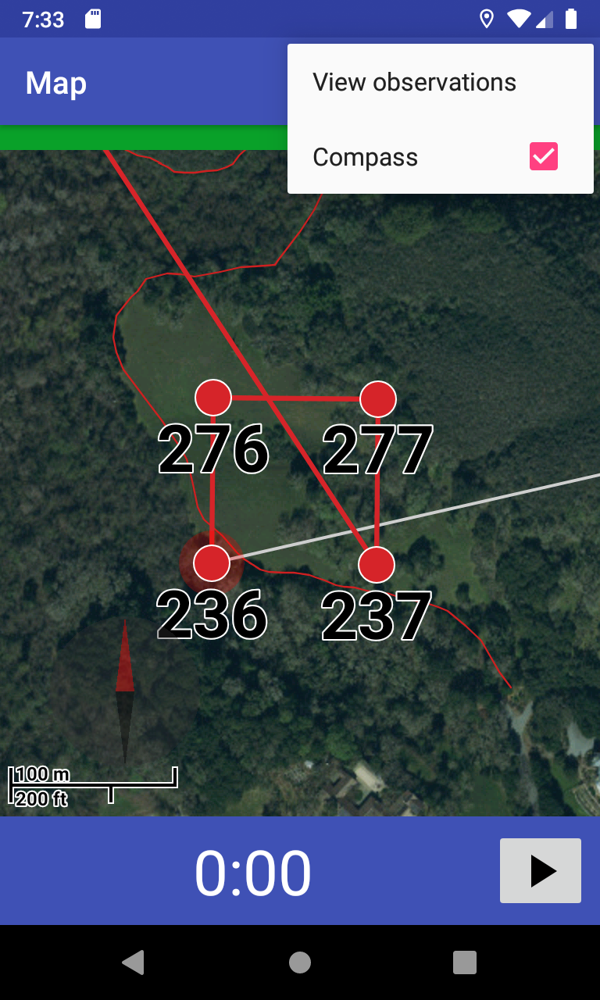
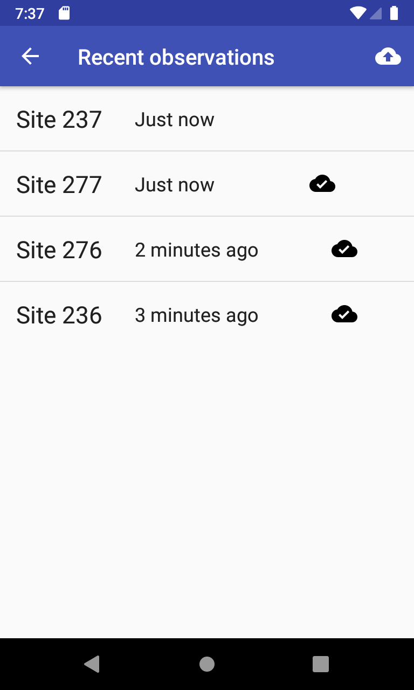
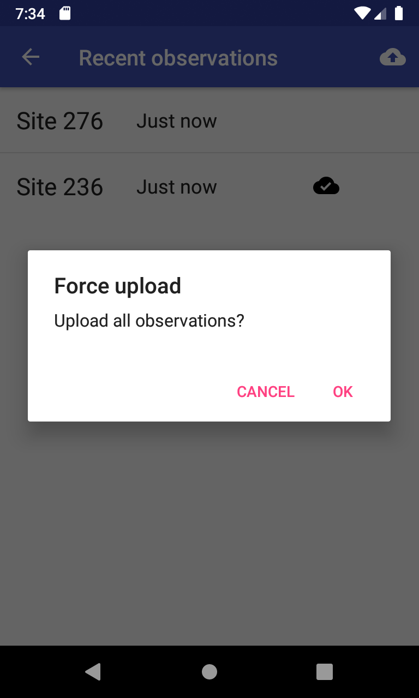
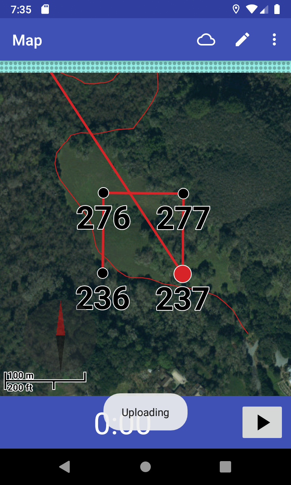
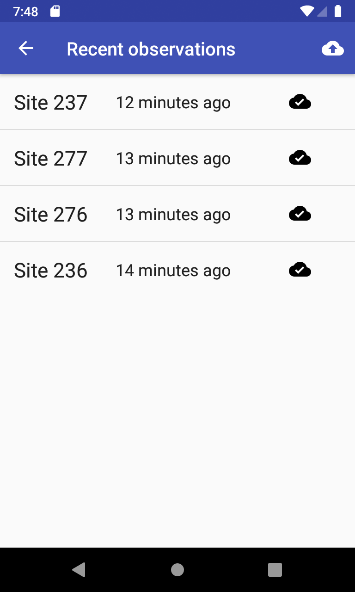

# Observation upload guide

## Automatic uploading

Once you save an observation, JRBP survey will automatically try to upload it starting 10 minutes
after the time it was saved. For this to happen, the device must have an Internet connection and
the JRBP Survey application must be open.

## Getting upload status information

To open the observation list, open the menu by tapping on the three dots at the right of the
toolbar at the top of the screen. Then tap on "View observations."

This will show a list of all observations saved on this device within the last 48 hours:

On each row of the list, the cloud check mark icon means that the observation has already been
uploaded.

## Manual uploading

If an observation has not been uploaded for 10 minutes and the device has an Internet connection,
you can force the application to upload all observations that have not already been uploaded.
Start this process by tapping on the cloud icon in the toolbar above the observation list, and then
confirming that you want to force the upload.

This will take you back to the map view. You can use the upload status bar, which is just above the
top of the map and below the toolbar, to see if the uploading is working.

The above image shows a blue upload status bar, which means that the application is uploading
observations.

If the upload status bar turns green, the application has successfully uploaded all observations.
Yellow indicates a problem with the upload.

You can open the observation list again to confirm the results. If all the observations were
uploaded, each observation on the list will have a cloud check mark icon.

